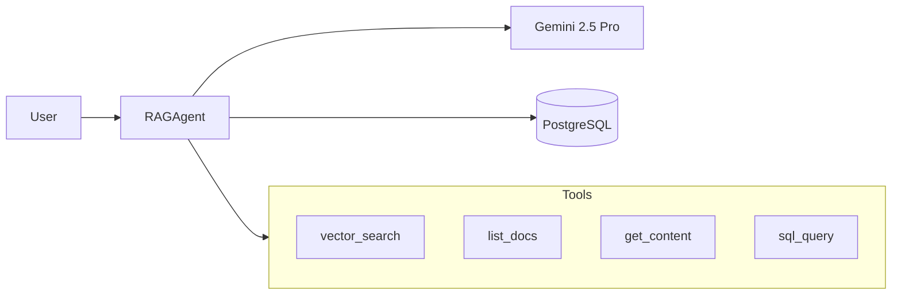

# Phase 3 Execution Report: Retrieval System & AI Agent

## Summary

Implemented the complete retrieval system with AI agent matching the n8n Ultimate RAG workflow. Live testing discovered and fixed a critical async bug.

---

## Files Created

### Foundation
| File | Purpose |
|------|---------|
| [memory.py](file:///c:/Environment/RAG/ultimate_rag/src/agent/memory.py) | PostgreSQL chat memory |
| [prompts.py](file:///c:/Environment/RAG/ultimate_rag/src/agent/prompts.py) | System prompts matching n8n |

### Agent Tools
| File | Purpose |
|------|---------|
| [vector_search.py](file:///c:/Environment/RAG/ultimate_rag/src/agent/tools/vector_search.py) | pgvector cosine similarity (top 25) |
| [list_docs.py](file:///c:/Environment/RAG/ultimate_rag/src/agent/tools/list_docs.py) | List document_metadata |
| [get_content.py](file:///c:/Environment/RAG/ultimate_rag/src/agent/tools/get_content.py) | Get full document by file_id |
| [sql_query.py](file:///c:/Environment/RAG/ultimate_rag/src/agent/tools/sql_query.py) | Safe SQL on tabular data |

### Core
| File | Purpose |
|------|---------|
| [agent.py](file:///c:/Environment/RAG/ultimate_rag/src/agent/agent.py) | RAGAgent with LangChain |
| [__init__.py](file:///c:/Environment/RAG/ultimate_rag/src/agent/__init__.py) | Module exports |

### Tests
| File | Purpose |
|------|---------|
| [test_agent.py](file:///c:/Environment/RAG/ultimate_rag/tests/test_agent.py) | 15 unit tests |
| [test_live_agent.py](file:///c:/Environment/RAG/ultimate_rag/tests/test_live_agent.py) | Live tool tests |
| [test_agent_e2e.py](file:///c:/Environment/RAG/ultimate_rag/tests/test_agent_e2e.py) | E2E agent test |
| [demo_rag.py](file:///c:/Environment/RAG/ultimate_rag/tests/demo_rag.py) | PDF ingest demo |

---

## Bug Discovered & Fixed

> [!IMPORTANT]
> **Critical async bug found through live testing** - mocked tests passed but real execution failed.

### Problem
```
NotImplementedError: StructuredTool does not support sync invocation
```

### Root Cause
`executor.invoke()` wrapped in `run_in_executor` cannot call async tools.

### Fix
```diff
- loop = asyncio.get_event_loop()
- result = await loop.run_in_executor(None, lambda: self.executor.invoke({...}))
+ result = await self.executor.ainvoke({...})
```

---

## Validation Results

| Test | Result |
|------|--------|
| Ruff linting | ✅ Passed |
| Unit tests (15) | ✅ Passed |
| list_docs_tool | ✅ 10 documents |
| vector_search_tool | ✅ 19 chunks |
| get_content_tool | ✅ Retrieved |
| sql_query_tool | ✅ 6 rows |
| SQL injection block | ✅ DROP/DELETE blocked |
| E2E agent | ✅ Full conversation |
| PDF ingestion + query | ✅ Working |
| Chat memory persistence | ✅ 7 entries stored |

---

## Architecture



---

## Key Learnings

1. **Mocking ≠ Testing** - Unit tests passed but live tests found critical bug
2. **Async matters** - LangChain requires `ainvoke()` for async tools
3. **pgvector works** - Cosine similarity search functional with Gemini embeddings
